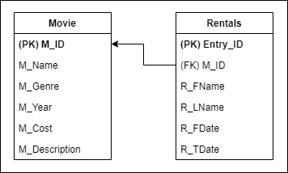

# **Passion Project**

## **1. About**
Passion project, also known as Blockbuster's admin system is an ASP.NET Web Application, developed using Entity Framework, that is used to manage the movies rented out by the store, as well as the list of rentals. 

This application allows you to perform CRUD operations on either tables i.e. the movies or the rentals.

<p align="center">
    
</p>

### **Note**: All movie poster image links used in this project have been sourced from IMDb or Amazon.ca .

## **Table of Content:**
1. <a href="#fs">Folder Structure</a>
2. <a href="#scope">Scope</a>
3. <a href="#rts">Running this project</a>
4. <a href="#demo">Demonstration</a>

## 1. <a name="fs">**Folder Structure:**</a>
```
PassionProject
    ├───App_Data
    ├───App_Start
    ├───Areas
    │   └───HelpPage
    │       ├───App_Start
    │       ├───Controllers
    │       ├───ModelDescriptions
    │       ├───Models
    │       ├───SampleGeneration
    │       └───Views
    │           ├───Help
    │           │   └───DisplayTemplates
    │           └───Shared
    ├───bin
    ├───Content
    │   └───images
    ├───Controllers
    ├───fonts
    ├───Migrations
    ├───Models
    ├───obj
    ├───Properties
    ├───Scripts
    └───Views
        ├───Home
        ├───Movie
        ├───Rental
        └───Shared
```

## 2. <a name="scope">**Scope**</a>
*   Manage list of movies
*   Manage list of rentals renting a particular movie

## 3. <a name="rts">**Running this project**</a>
*  Clone the repository
*  Tools > Nuget Package Manager > Package Manage Console > Update-Database
*  Check the database created using the server explorer. (View > Server Explorer)
* Run the <a hrerf="https://github.com/jendcruz22/PassionProject/blob/main/PassionProject/Views/Movie/List.cshtml">List view</a> to load the home page of the application

## 4. <a name="demo">**Demonstration video:**</a>
* Click <a href="https://youtu.be/HHFcjsPfpRE">**here**</a> to view the project's demonstration.
